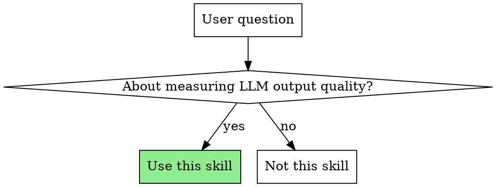
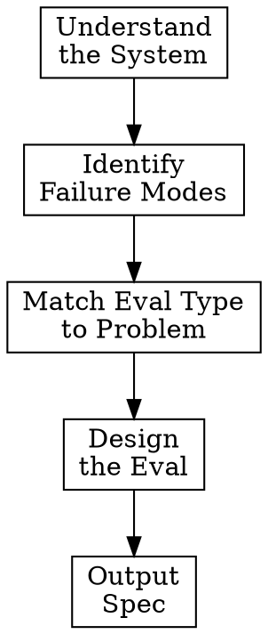

# Eval Design

Guide users through designing production-quality LLM evaluations. Output: structured spec a coding agent can implement with Langfuse.

**Announce at start:** "I'm using the eval-design skill to help design your evaluation."

## When to Use

**Use for:**
- Designing new evaluations
- Choosing between eval approaches
- Creating scoring rubrics or judge prompts
- Building golden datasets
- Questions like "how do I know if my LLM is working?"

**Not for:**
- Langfuse setup, tracing, or observability (use langfuse-cli skill)
- Implementing evals (output spec to coding agent)
- Generic testing that isn't LLM-specific

## The Process

Ask questions ONE AT A TIME. Adapt depth based on user's experience level.

## Phase 1: Understand the System

Ask about:
- What does the LLM application do? (summarisation, Q&A, agent, chat)
- What's already instrumented in Langfuse? (traces, spans, generations)
- What does a "good" output look like for users?

## Phase 2: Identify Failure Modes

Key questions:
- What failures have you seen in production?
- Have you done error analysis on real traces?
- Which failures have the highest business impact?

**Critical:** Ground eval design in ACTUAL failures, not hypothetical concerns. If user hasn't analysed real failures, recommend starting there.

## Phase 3: Match Eval Type to Problem

| Problem Type | Recommended Eval |
|--------------|------------------|
| Format validation (JSON, dates) | Code-based |
| Factual accuracy with known answers | Code-based + match |
| Tone, helpfulness, coherence | LLM-as-judge |
| Safety, toxicity | LLM-as-judge |
| RAG retrieval quality | LLM-as-judge per chunk |
| High-stakes decisions | Human → LLM-judge |
| Novel/unclear failure modes | Human annotation first |

Consult `references/eval-types.md` for detailed guidance on each type.

## Phase 4: Design the Eval

For each eval, define:
1. **Success criteria** - prefer binary PASS/FAIL over Likert scales
2. **Rubric or logic** - specific, unambiguous criteria
3. **Dataset requirements** - happy path + edge cases + adversarial
4. **Integration** - when/where to run

Use `references/judge-prompts.md` for LLM-as-judge prompt templates.

## Output Format

Output a structured spec using the template in `references/document-template.md`.

The spec should be complete enough that a coding agent can implement it using the Langfuse SDK without further clarification.

## Principles for Great Evals

### Start from Error Analysis

Examine real failures, not hypothetical concerns. Generic metrics ("hallucination score") without grounding in actual user complaints are noise.

Questions to surface:
- "What would a human expert check when reviewing this output?"
- "If this eval passes but users are unhappy, what did we miss?"

### Match Tool to Task

Don't over-engineer:
- Code-based evals are faster, cheaper, more deterministic
- Only use LLM-as-judge when judgment is genuinely subjective
- Human annotation for calibration, not production eval

### Binary PASS/FAIL Over Likert

Rating 1-5 creates noise and inconsistency. Binary forces clarity:
- What exactly makes something PASS?
- What exactly makes something FAIL?

### Cover the Right Cases

Dataset should include:
- **Happy path**: Common, expected inputs
- **Edge cases**: Boundaries, unusual but valid inputs
- **Adversarial**: Inputs designed to break the system

### Calibrate LLM Judges

Before deploying LLM-as-judge:
1. Create human-labelled examples (20-30)
2. Run judge on same examples
3. Measure agreement (target >85%)
4. Adjust prompt until calibrated

## Red Flags to Watch For

Push back when you see:
- Jumping to LLM-as-judge when code-based would suffice
- Likert scales instead of binary
- Generic metrics without connection to actual failures
- Missing adversarial cases
- No plan for calibration

## Anti-Patterns

**"Vibes-based" evaluation:** Testing a few examples and shipping if it "looks good"
→ Systematic dataset with coverage of failure modes

**Evaluating the model, not the product:** Generic benchmarks that don't reflect real use
→ Evals grounded in actual user complaints and failures

**Over-engineering:** Complex eval pipelines for simple checks
→ Simplest eval that catches the failure mode

## Handoff to Implementation

After outputting the spec:

"This eval design is ready for implementation. A coding agent can use the `langfuse-cli` skill to implement this using the Langfuse SDK."

Do NOT attempt to implement the eval. The skill outputs design specs only.

## Quick Reference

| User Says | Do This |
|-----------|---------|
| "How do I know if my LLM is working?" | Start Phase 1 |
| "I need to evaluate [specific thing]" | Jump to Phase 2, focus on that failure mode |
| "Should I use LLM-as-judge?" | Ask about failure mode → recommend based on type |
| "Help me write a judge prompt" | Use `references/judge-prompts.md` templates |
| "What should my dataset look like?" | Cover happy path + edge + adversarial |

## Additional Resources

### Reference Files

- **`references/document-template.md`** - Output spec template with guidance
- **`references/eval-types.md`** - Detailed eval type selection and patterns
- **`references/judge-prompts.md`** - Ready-to-use LLM-as-judge prompts
