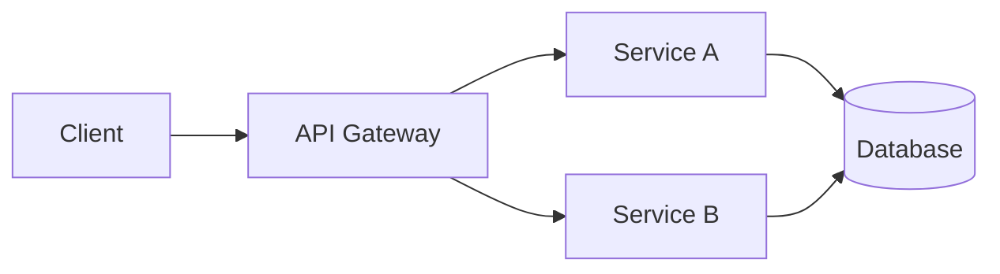

# README Patterns Reference

Detailed patterns, templates, and examples for creating excellent READMEs.

## Badge Patterns

### Common Badge Services

**Shields.io** - The most versatile badge service:

```markdown
<!-- Build Status -->


<!-- Version -->


<!-- Downloads -->


<!-- Licence -->


<!-- Code Coverage -->


<!-- Code Quality -->


<!-- Last Commit -->


<!-- Stars -->


<!-- Issues -->


<!-- PRs Welcome -->

```

### Badge Layout Patterns

**Minimal** (for small utilities):
```markdown
 
```

**Standard** (for most projects):
```markdown


```

**Comprehensive** (for mature projects):
```markdown
[](https://github.com/owner/repo/actions)
[](https://codecov.io/gh/owner/repo)
[](https://www.npmjs.com/package/pkg)
[](https://www.npmjs.com/package/pkg)
[](LICENCE)
[](CONTRIBUTING.md)
```

### Custom Badges

Create custom badges with Shields.io:

```markdown


<!-- Examples -->


```

## Table of Contents Patterns

### Manual TOC

```markdown
## Table of Contents

- [Installation](#installation)
- [Quick Start](#quick-start)
- [Usage](#usage)
  - [Basic Usage](#basic-usage)
  - [Advanced Configuration](#advanced-configuration)
- [API Reference](#api-reference)
- [Contributing](#contributing)
- [Licence](#licence)
```

### Collapsible TOC (for long READMEs)

```markdown
<details>
<summary>Table of Contents</summary>

- [Installation](#installation)
- [Quick Start](#quick-start)
- [Usage](#usage)
- [API Reference](#api-reference)
- [Contributing](#contributing)
- [Licence](#licence)

</details>
```

## Visual Element Patterns

### Screenshot with Caption

```markdown

*The main dashboard showing real-time metrics*
```

### GIF Demo

```markdown

```

Tools for creating GIFs:
- **macOS**: Kap, Gifox, CleanShot X
- **Linux**: Peek, Byzanz
- **Windows**: ScreenToGif, ShareX
- **Cross-platform**: Asciinema (for terminal recordings)

### ASCII Art Logo

```markdown
```
  ____            _           _
 |  _ \ _ __ ___ (_) ___  ___| |_
 | |_) | '__/ _ \| |/ _ \/ __| __|
 |  __/| | | (_) | |  __/ (__| |_
 |_|   |_|  \___// |\___|\___|\__|
               |__/
```
```

### Architecture Diagram (Mermaid)

```markdown

```

## Installation Patterns

### Multi-Package-Manager

```markdown
## Installation

### npm
\`\`\`bash
npm install package-name
\`\`\`

### yarn
\`\`\`bash
yarn add package-name
\`\`\`

### pnpm
\`\`\`bash
pnpm add package-name
\`\`\`
```

### With Prerequisites

```markdown
## Installation

### Prerequisites

- Node.js 18+
- npm 9+ or yarn 1.22+
- Git

### Install

\`\`\`bash
npm install package-name
\`\`\`
```

### From Source

```markdown
## Building from Source

\`\`\`bash
git clone https://github.com/owner/repo.git
cd repo
npm install
npm run build
\`\`\`
```

## Usage Example Patterns

### Progressive Complexity

```markdown
## Usage

### Basic

\`\`\`javascript
import { parse } from 'my-parser';

const result = parse('input');
console.log(result);
\`\`\`

### With Options

\`\`\`javascript
import { parse } from 'my-parser';

const result = parse('input', {
  strict: true,
  format: 'json'
});
\`\`\`

### Advanced: Custom Handlers

\`\`\`javascript
import { Parser } from 'my-parser';

const parser = new Parser({
  onError: (err) => console.error(err),
  onWarning: (msg) => console.warn(msg)
});

const result = parser.parse('input');
\`\`\`
```

### CLI Examples

```markdown
## Usage

\`\`\`bash
# Basic usage
mytool input.txt

# With options
mytool input.txt --output result.json --verbose

# Process multiple files
mytool *.txt --output-dir ./results

# Read from stdin
cat input.txt | mytool
\`\`\`
```

### With Output

```markdown
\`\`\`bash
$ mytool --version
mytool 2.1.0

$ mytool analyse file.js
Analysing file.js...
  - 150 lines of code
  - 12 functions
  - 0 issues found
\`\`\`
```

## Configuration Patterns

### Environment Variables

```markdown
## Configuration

| Variable | Description | Default |
|----------|-------------|---------|
| `API_KEY` | Your API key | - |
| `DEBUG` | Enable debug logging | `false` |
| `TIMEOUT` | Request timeout (ms) | `5000` |

\`\`\`bash
export API_KEY=your-key-here
export DEBUG=true
\`\`\`
```

### Config File

```markdown
## Configuration

Create a `config.json` in your project root:

\`\`\`json
{
  "apiKey": "your-key",
  "options": {
    "timeout": 5000,
    "retries": 3
  }
}
\`\`\`

Or use environment-specific files:
- `config.development.json`
- `config.production.json`
```

## API Documentation Patterns

### Function Reference

```markdown
## API

### `parse(input, options?)`

Parse the input string.

**Parameters:**

| Name | Type | Description |
|------|------|-------------|
| `input` | `string` | The string to parse |
| `options.strict` | `boolean` | Enable strict mode (default: `false`) |
| `options.format` | `'json' \| 'yaml'` | Output format (default: `'json'`) |

**Returns:** `ParseResult`

**Example:**

\`\`\`javascript
const result = parse('input', { strict: true });
\`\`\`

**Throws:**

- `ParseError` - If input is malformed
```

### Collapsible API Sections

```markdown
<details>
<summary><code>parse(input, options?)</code></summary>

Parse the input string.

**Parameters:**
- `input` (string): The string to parse
- `options` (object, optional): Configuration options

**Returns:** ParseResult

**Example:**
\`\`\`javascript
const result = parse('input');
\`\`\`

</details>
```

## Contributing Section Patterns

### Minimal

```markdown
## Contributing

Contributions welcome! Please read [CONTRIBUTING.md](CONTRIBUTING.md) first.
```

### Expanded

```markdown
## Contributing

We welcome contributions!

### Getting Started

1. Fork the repository
2. Create a feature branch (`git checkout -b feature/amazing-feature`)
3. Make your changes
4. Run tests (`npm test`)
5. Commit (`git commit -m 'Add amazing feature'`)
6. Push (`git push origin feature/amazing-feature`)
7. Open a Pull Request

### Development Setup

\`\`\`bash
git clone https://github.com/your-fork/repo.git
cd repo
npm install
npm run dev
\`\`\`

See [CONTRIBUTING.md](CONTRIBUTING.md) for detailed guidelines.
```

## Acknowledgements Patterns

### Simple

```markdown
## Acknowledgements

- [Library A](https://example.com) - Description
- [Person B](https://github.com/personb) - For inspiration
```

### With Contributors

```markdown
## Contributors

Thanks to everyone who has contributed!

<a href="https://github.com/owner/repo/graphs/contributors">
  
</a>
```

## Complete README Templates

### Minimal Template (Small Utility)

```markdown
# project-name

Brief description of what this does.

## Install

\`\`\`bash
npm install project-name
\`\`\`

## Usage

\`\`\`javascript
import { thing } from 'project-name';
thing();
\`\`\`

## Licence

MIT
```

### Standard Template (Most Projects)

```markdown
# Project Name

  

Brief description of what this project does and why it's useful.


## Quick Start

\`\`\`bash
npm install project-name
\`\`\`

\`\`\`javascript
import { main } from 'project-name';
main();
\`\`\`

## Installation

[Detailed installation instructions]

## Usage

[Usage examples from simple to complex]

## Configuration

[Configuration options]

## Contributing

Contributions welcome! See [CONTRIBUTING.md](CONTRIBUTING.md).

## Licence

MIT - see [LICENCE](LICENCE)
```

### Comprehensive Template (Mature Projects)

```markdown
<p align="center">
  
</p>

<h1 align="center">Project Name</h1>

<p align="center">
  Tagline describing the project in one sentence.
</p>

<p align="center">
  <a href="https://github.com/owner/repo/actions"></a>
  <a href="https://codecov.io/gh/owner/repo"></a>
  <a href="https://www.npmjs.com/package/pkg"></a>
  <a href="LICENCE"></a>
</p>

<p align="center">
  <a href="#features">Features</a> •
  <a href="#installation">Installation</a> •
  <a href="#usage">Usage</a> •
  <a href="#documentation">Docs</a> •
  <a href="#contributing">Contributing</a>
</p>


## Features

- Feature one with benefit
- Feature two with benefit
- Feature three with benefit

## Installation

[Comprehensive installation for all platforms]

## Quick Start

[Fastest path to hello world]

## Usage

[Progressive examples]

## Documentation

Full documentation at [docs.example.com](https://docs.example.com)

## Roadmap

- [x] Completed feature
- [ ] Planned feature
- [ ] Future feature

## Contributing

See [CONTRIBUTING.md](CONTRIBUTING.md) for guidelines.

## Acknowledgements

- [Dependency](link) - What it provides
- [@contributor](link) - For what

## Licence

MIT - see [LICENCE](LICENCE)
```

## Language-Specific Patterns

### JavaScript/TypeScript

```markdown
## TypeScript

This package includes TypeScript definitions.

\`\`\`typescript
import { Config, Result } from 'package-name';

const config: Config = { strict: true };
const result: Result = process(config);
\`\`\`
```

### Python

```markdown
## Installation

\`\`\`bash
pip install package-name
\`\`\`

Or with Poetry:

\`\`\`bash
poetry add package-name
\`\`\`

## Usage

\`\`\`python
from package_name import Thing

thing = Thing()
result = thing.process()
\`\`\`
```

### Rust

```markdown
## Installation

Add to your `Cargo.toml`:

\`\`\`toml
[dependencies]
package-name = "1.0"
\`\`\`

## Usage

\`\`\`rust
use package_name::Thing;

fn main() {
    let thing = Thing::new();
    thing.process();
}
\`\`\`
```

### Go

```markdown
## Installation

\`\`\`bash
go get github.com/owner/repo
\`\`\`

## Usage

\`\`\`go
package main

import "github.com/owner/repo"

func main() {
    result := repo.Process()
}
\`\`\`
```

## Collapsible Sections

Use for optional or detailed content:

```markdown
<details>
<summary>Click to expand advanced configuration</summary>

[Detailed content here]

</details>
```

Multiple collapsible sections:

```markdown
<details>
<summary>macOS Installation</summary>

\`\`\`bash
brew install package
\`\`\`

</details>

<details>
<summary>Linux Installation</summary>

\`\`\`bash
apt install package
\`\`\`

</details>

<details>
<summary>Windows Installation</summary>

\`\`\`powershell
choco install package
\`\`\`

</details>
```

## Keyboard Navigation

For CLI tools or applications with shortcuts:

```markdown
## Keyboard Shortcuts

| Key | Action |
|-----|--------|
| `Ctrl+C` | Copy |
| `Ctrl+V` | Paste |
| `Ctrl+Z` | Undo |
| `?` | Show help |
```
